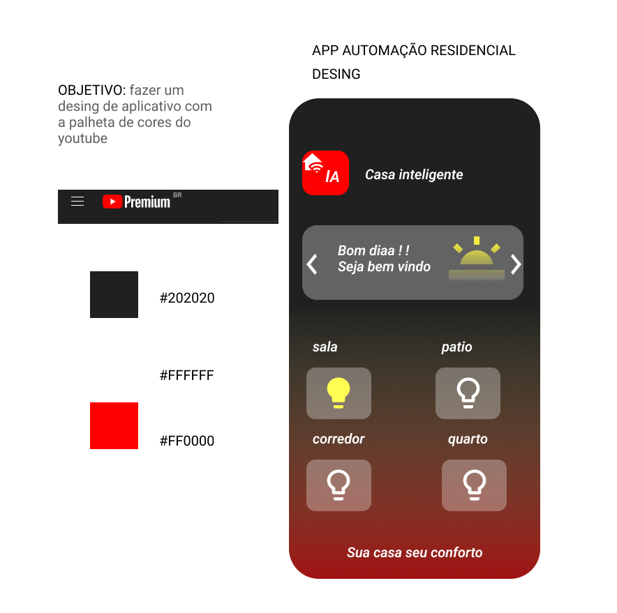
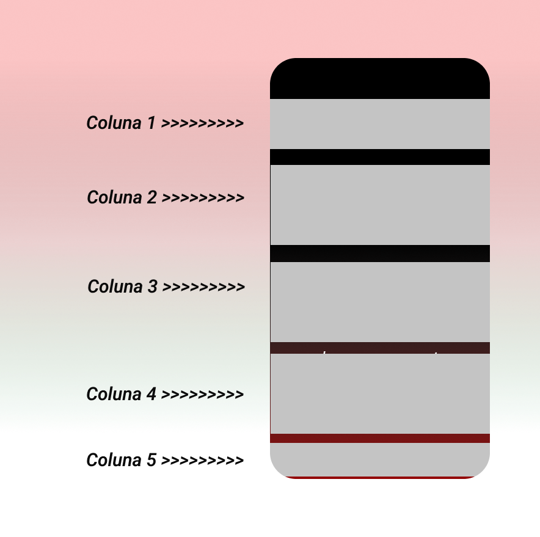
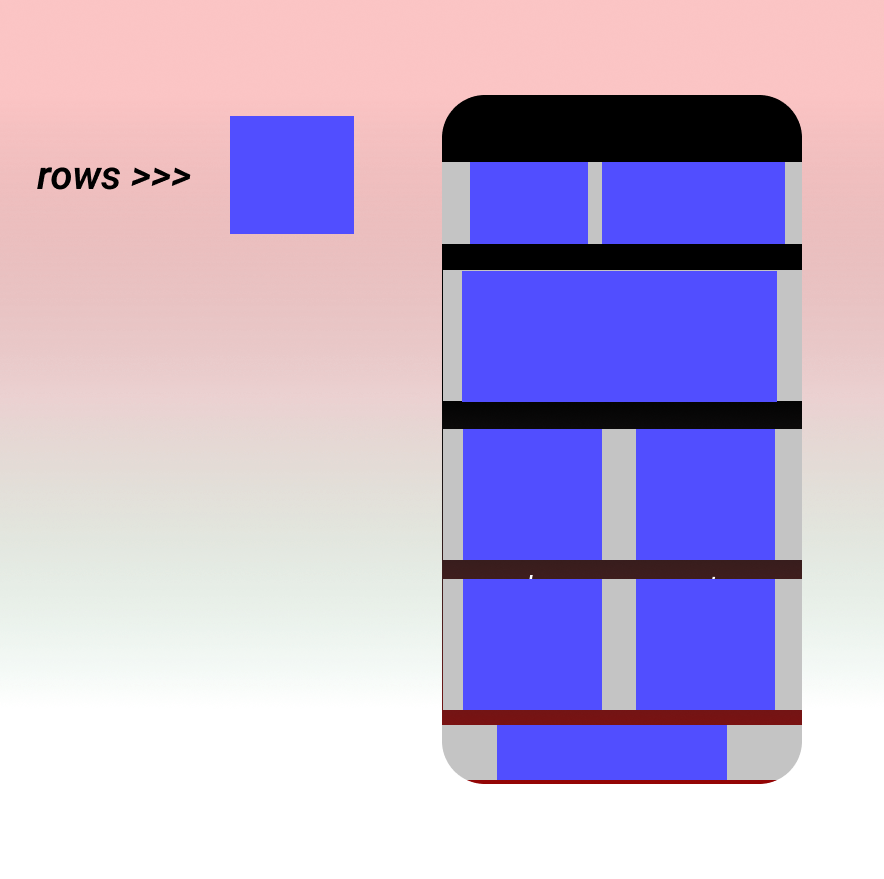
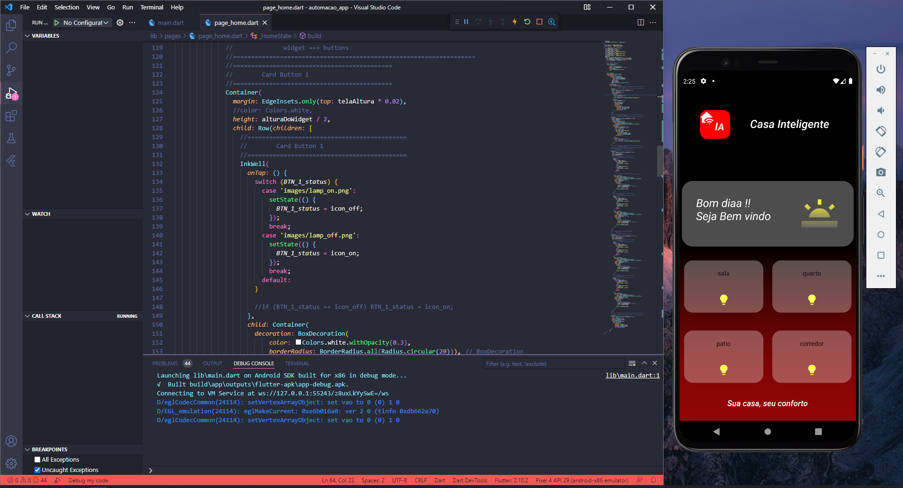

# DESENVOLVIMENTO RAPIDO
## Aplicativo de automação residencial
### 

## Sobre seu layout  

    
     Assim tudo desenhado no aplicativo figma passo a
     rever os containers
     A imagem representa em colunms >> 4 colunas
## Colunas organizadas em container

>###     Container 1 , 2 , 3 , 4 , 5 || e por ai vai 
     E essa é apenas o começo da organização 
# Marcado e planejado so progamar e fazer o layout e adicionar

>### Codigo  disponivel para estudo 

#### Saiba mais sobre meus estudos  / Redes sociais 

